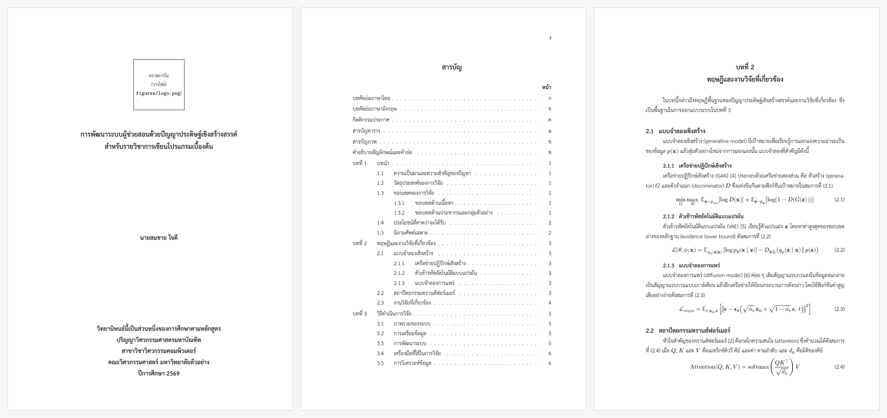

# thai-thesis-xelatex

แม่แบบวิทยานิพนธ์ภาษาไทยสำหรับ XeLaTeX · A Thai thesis template for XeLaTeX



[English](#english) · [ภาษาไทย](#ภาษาไทย)

---

## English

A ready-to-use LaTeX template for theses, dissertations and reports written in Thai, following the layout most Thai universities require.

**Features**

- TH Sarabun New 16 pt, with automatic Thai word breaking (ICU)
- A4, margins 1.5″ top/left and 1″ right/bottom (easy to change)
- Front matter numbered ก ข ค …, main text 1 2 3 … (top right)
- Cover, Thai and English title pages, approval page with signature lines, Thai and English abstracts, acknowledgements, table of contents, lists of tables and figures, abbreviations, chapters 1–5, bibliography (biblatex + Biber), appendices ก ข …, and author biography
- Thai captions (ภาพที่ / ตารางที่), equations, code listings, long tables that continue across pages

**Requirements**

A full TeX distribution: [MacTeX](https://tug.org/mactex/) (macOS), [TeX Live](https://tug.org/texlive/) (Windows/Linux) or MiKTeX. The template must be compiled with **XeLaTeX**.

**Quick start**

1. Click **Use this template** (or download the ZIP).
2. Edit your details in `main.tex` and write your chapters in `chapters/`.
3. Build:

   ```bash
   latexmk        # produces build/main.pdf (XeLaTeX + Biber)
   latexmk -c     # remove temporary files
   ```

   In VS Code with the *LaTeX Workshop* extension, just save the file; the included `.vscode/settings.json` handles the rest.

**Fonts**

The class looks for fonts in this order:

1. `fonts/THSarabunNew.ttf` (+ `-Bold`, `-Italic`, `-BoldItalic`) inside the project
2. **TH Sarabun New** installed on your computer ([free download](https://www.f0nt.com/release/th-sarabun-new/))
3. **TH SarabunPSK** installed on your computer
4. **Laksaman**, a TH Sarabun New derivative that ships with TeX Live, MacTeX and Overleaf

So it compiles out of the box everywhere, and uses the official font when you have it.

**License and citation**

Released under the [MIT License](LICENSE) © 2026 Chayun Kongtongvattana. The documents you write with it are entirely yours.

The sample acknowledgements include one sentence crediting this template. Keeping it is optional but much appreciated. To cite the template, use the **Cite this repository** button on GitHub or the entry `kongtongvattana2026thaithesis` in `references.bib`.

---

## ภาษาไทย

แม่แบบ LaTeX สำหรับวิทยานิพนธ์/รายงานภาษาไทย ตามรูปแบบที่มหาวิทยาลัยไทยใช้กันทั่วไป

- ฟอนต์ **TH Sarabun New 16 pt** และตัดคำภาษาไทยอัตโนมัติ
- กระดาษ A4 ขอบบน 1.5" ซ้าย 1.5" ขวา 1" ล่าง 1"
- เลขหน้าส่วนนำเป็น ก ข ค … ส่วนเนื้อหาเป็น 1 2 3 … (มุมขวาบน)
- มีปกนอก ปกในไทย/อังกฤษ หน้าอนุมัติ บทคัดย่อไทย/อังกฤษ กิตติกรรมประกาศ สารบัญ สารบัญตาราง สารบัญภาพ คำอธิบายสัญลักษณ์และคำย่อ บทที่ 1–5 บรรณานุกรม ภาคผนวก ก, ข และประวัติผู้เขียน

ไฟล์ผลลัพธ์และไฟล์ชั่วคราวทั้งหมดจะอยู่ในโฟลเดอร์ `build/` (PDF คือ `build/main.pdf`)

### 1. ติดตั้งโปรแกรม (ครั้งแรกครั้งเดียว)

- **macOS:** ติดตั้ง [MacTeX ฉบับเต็ม](https://tug.org/mactex/) หรือ `brew install --cask mactex-no-gui`
- **Windows / Linux:** ติดตั้ง [TeX Live](https://tug.org/texlive/) หรือ MiKTeX

> แนะนำฉบับเต็ม เพราะฉบับย่อ (เช่น BasicTeX) จะขาดแพ็กเกจที่ต้องใช้ (biblatex-ieee, pgfplots ฯลฯ)

### 2. ฟอนต์

ไม่ต้องทำอะไรก็คอมไพล์ได้ทันที โดยระบบจะเลือกฟอนต์ตามลำดับนี้

1. ไฟล์ `fonts/THSarabunNew.ttf` (และ `-Bold`, `-Italic`, `-BoldItalic`) ในโปรเจกต์
2. **TH Sarabun New** ที่ติดตั้งในเครื่อง ([ดาวน์โหลดฟรี](https://www.f0nt.com/release/th-sarabun-new/))
3. **TH SarabunPSK** ที่ติดตั้งในเครื่อง
4. **Laksaman** ฟอนต์ที่พัฒนาต่อจาก TH Sarabun New ซึ่งมากับ TeX Live / MacTeX / Overleaf อยู่แล้ว (หน้าตาเกือบเหมือนกัน)

ถ้าต้องการฟอนต์ TH Sarabun New ตัวจริง ให้ติดตั้งลงเครื่อง หรือคัดลอกไฟล์ `.ttf` มาไว้ในโฟลเดอร์ `fonts/`

### 3. คอมไพล์

**Terminal**

```bash
cd ไปยังโฟลเดอร์นี้
latexmk               # สร้าง build/main.pdf (XeLaTeX + Biber อัตโนมัติ)
latexmk -c            # ลบไฟล์ชั่วคราว
```

**VS Code** ติดตั้งส่วนขยาย *LaTeX Workshop* แล้วเปิดโฟลเดอร์นี้ กดบันทึก (⌘S / Ctrl+S) ระบบจะคอมไพล์ให้เอง และแสดง `build/main.pdf` (ตั้งค่าไว้แล้วใน `.vscode/settings.json`)

> อย่าใส่บรรทัด `% !TEX program = ...` ที่หัว `main.tex` เพราะ VS Code จะข้ามการตั้งค่านี้แล้ววางไฟล์ชั่วคราวไว้นอกโฟลเดอร์ `build/`

> ต้องใช้ **XeLaTeX** เท่านั้น (ถ้าใช้ pdfLaTeX จะแจ้งข้อผิดพลาด)

### 4. โครงสร้างไฟล์

```
main.tex                  ไฟล์หลัก: ข้อมูลวิทยานิพนธ์ + ลำดับบท
thaithesis.cls            รูปแบบเอกสาร (ปกติไม่ต้องแก้)
references.bib            รายการเอกสารอ้างอิง
latexmkrc                 ตั้งค่าการคอมไพล์
frontmatter/              บทคัดย่อ กิตติกรรมประกาศ คำย่อ
chapters/                 บทที่ 1–5
appendices/               ภาคผนวก ก, ข, …
backmatter/biography.tex  ประวัติผู้เขียน
figures/                  รูปภาพ และตราสถาบัน (logo.png)
fonts/                    (ไม่บังคับ) ไฟล์ฟอนต์ TH Sarabun New
docs/                     ภาพตัวอย่างสำหรับหน้า GitHub
```

### 5. เริ่มใช้งาน

1. แก้ข้อมูลใน `main.tex` (ชื่อเรื่อง ผู้เขียน ปริญญา สาขา คณะ สถาบัน อาจารย์ที่ปรึกษา กรรมการ คำสำคัญ)
2. วางไฟล์ตราสถาบันเป็น `figures/logo.png` (หรือ `.pdf` / `.jpg`)
3. เขียนเนื้อหาในไฟล์ `chapters/chapter1.tex` … `chapter5.tex`
4. เพิ่มบทใหม่: สร้างไฟล์ใน `chapters/` แล้วเพิ่ม `\input{chapters/ชื่อไฟล์}` ใน `main.tex`
5. ไม่ต้องการหน้าใด (เช่น หน้าอนุมัติ) ให้ใส่ `%` หน้าคำสั่งนั้นใน `main.tex`

### 6. คำสั่งที่ใช้บ่อย

| ต้องการ | คำสั่ง |
|---|---|
| บท / หัวข้อ / หัวข้อย่อย | `\chapter{}` `\section{}` `\subsection{}` `\subsubsection{}` |
| อ้างอิงเอกสาร | `\cite{key}` (key จาก `references.bib`) |
| อ้างถึงภาพ/ตาราง/สมการ | `ภาพที่~\ref{fig:x}` `ตารางที่~\ref{tab:x}` `สมการที่~\eqref{eq:x}` |
| แทรกรูป | `\includegraphics[width=0.8\linewidth]{ชื่อไฟล์}` (ไฟล์ใน `figures/`) |
| ตารางยาวข้ามหน้า | `longtable` (ดูตัวอย่างในบทที่ 4) |
| โค้ดโปรแกรม | `\begin{lstlisting}[language=Python] … \end{lstlisting}` |
| คำย่อ | `\abbr{คำย่อ}{ความหมาย}` ใน `frontmatter/abbreviations.tex` |
| บทที่ไม่มีเลขและอยู่ในสารบัญ | `\unnumberedchapter{ชื่อ}` |

รูปแบบคำบรรยาย: ภาพ = "ภาพที่ 1.1" ใต้ภาพ, ตาราง = "ตารางที่ 1.1" เหนือตาราง (ให้เขียน `\caption` ไว้ก่อน `tabular`)

### 7. ปรับรูปแบบตามข้อกำหนดของสถาบัน

ตัวเลือกใน `\documentclass[...]{thaithesis}`

| ตัวเลือก | ผล |
|---|---|
| `pagebottom` | เลขหน้ากึ่งกลางด้านล่าง |
| `chapterpagenumber` | แสดงเลขหน้าในหน้าแรกของบทด้วย |
| `systemfont` | ข้ามไฟล์ใน `fonts/` แล้วใช้ฟอนต์ที่ติดตั้งในเครื่อง |

ปรับเพิ่มเติมใน `main.tex` (ก่อน `\begin{document}`)

```latex
\geometry{top=3.5cm, left=3.5cm, right=2.5cm, bottom=3.5cm}   % ขอบกระดาษ
\setlength\thesisindent{1.5cm}\setlength\parindent{\thesisindent} % ย่อหน้า
\renewcommand\thesisbibname{รายการอ้างอิง}                      % ชื่อหน้าบรรณานุกรม
\renewcommand\figurename{รูปที่}                                 % "ภาพที่" -> "รูปที่"
```

รูปแบบบรรณานุกรม: แก้ `style=ieee` เป็น `style=apa` ใน `main.tex` ถ้าต้องการแบบ APA

### 8. เคล็ดลับภาษาไทย

- **ตัดคำผิด** (มักเป็นชื่อเฉพาะ): ครอบคำด้วย `\mbox{…}` เพื่อไม่ให้ตัด
- **ชื่อผู้แต่งภาษาไทยใน `.bib`** ใส่ปีกกาสองชั้น `author = {{สมชาย ใจดี}}` เพื่อไม่ให้ระบบสลับชื่อ-นามสกุล
- **ข้อความไทยในสมการ** ใช้ `\text{…}` เช่น `$x_{\text{เฉลี่ย}}$`
- เมื่อคัดลอกข้อความจาก PDF อักษร "ำ" อาจกลายเป็น "ํา" (เป็นลักษณะของฟอนต์ ไม่มีผลต่อการพิมพ์)

### 9. แก้ปัญหา

| อาการ | วิธีแก้ |
|---|---|
| `XeTeX is required to compile this document` | เปลี่ยนตัวคอมไพล์เป็น XeLaTeX |
| คำเตือน `TH Sarabun New was not found` | ระบบใช้ Laksaman แทน ถ้าต้องการฟอนต์ตัวจริง ให้ติดตั้ง TH Sarabun New หรือวางไฟล์ไว้ใน `fonts/` |
| บรรณานุกรมไม่ขึ้น / `[key]` เป็นตัวหนา | ใช้ `latexmk` หรือรัน `biber` แล้วคอมไพล์ซ้ำ |
| สารบัญ/เลขหน้ายังไม่ตรง | คอมไพล์ซ้ำอีกครั้ง หรือ `latexmk -C` แล้ว `latexmk` ใหม่ |

### 10. สัญญาอนุญาตและการอ้างอิง

เผยแพร่ภายใต้ [MIT License](LICENSE) © 2026 ชยันต์ คงทองวัฒนา (Chayun Kongtongvattana) ใช้ แก้ไข และแจกจ่ายต่อได้อย่างอิสระ เอกสารที่เขียนด้วยแม่แบบนี้เป็นของผู้เขียนเองทั้งหมด

ในกิตติกรรมประกาศตัวอย่างมีประโยคหนึ่งที่ให้เครดิตแม่แบบนี้ จะคงไว้หรือไม่ก็ได้ แต่ถ้าคงไว้ผู้พัฒนาจะขอบคุณมากครับ หากต้องการอ้างอิงแม่แบบ ใช้ปุ่ม **Cite this repository** บน GitHub หรือรายการ `kongtongvattana2026thaithesis` ใน `references.bib`
